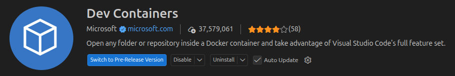

# PokeAgent Challenge

## Enviroment setup

- Download docker: https://docs.docker.com/desktop/setup/install/
- Download Dev Containers VSCode Extension: 
- Download Python VSCode Extension

## Run dev container

- Open Dev Container menu in sidebar
- Press the `Open Folder in Container` button. 